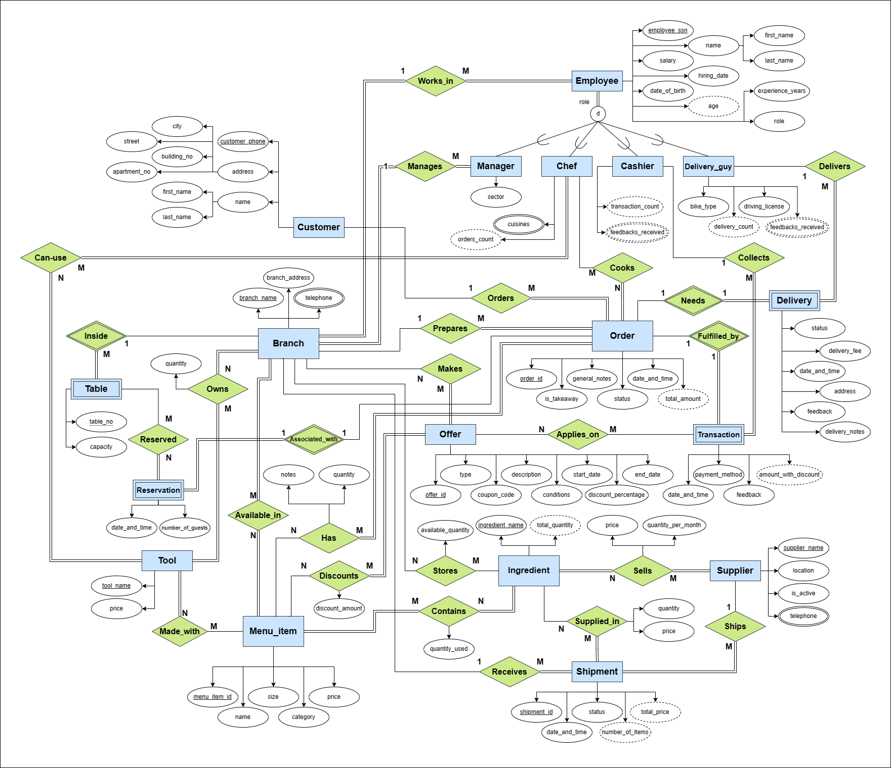
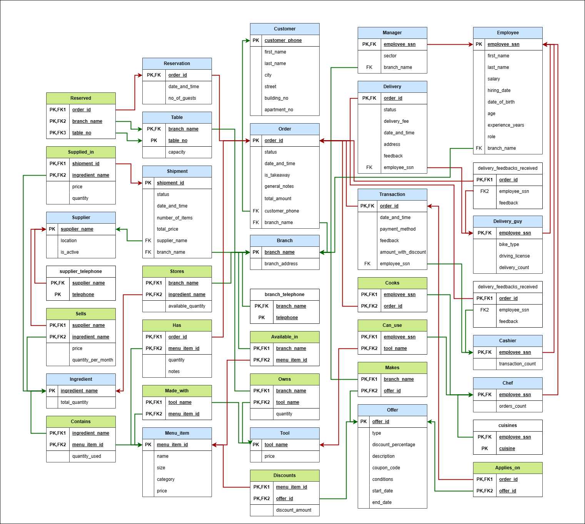

# Restaurant Franchise Database

The core idea of this project is creating a well-designed and fully detailed database for a big restaurant franchise, including every detail possible for the database to get close to how it would look like in the real world at a real franchise.

The project includes the following:
- The Entity Relationship Diagram (ERD) of the database.
- The Relational Schema of the database.
- The SQL implementation of the database, including the tables, the relationships, the constraints, the inserts, the queries, and the views.
- The SQL implementation of 18 reports that can be run on the database.

## Features

The database includes the following features:

- Tracking the shipments for each branch, including the date, the supplier, the ingredients in the shipment, its quantity and price.
- Tracking which ingredients are used in each dish, the quantity of each ingredient used in each dish, and the stock of each ingredient in each branch and which suppliers provide each ingredient.
- Tracking which menu items are served in each branch, the price of each item, the tools needed to prepare each item, and the ingredients needed to prepare each item.
- Tracking the tools available and their quantity in each branch, the tools needed to prepare each menu item, and which chefs are qualified to use each tool.
- Tracking the branches, the employees working in each branch, the tables in each branch, the reservations for tables, the orders for each table, the menu items ordered in each order, and the chefs who prepared each order.
- Tracking the orders for each branch:
    - Delivery: The delivery orders, the driver who delivered each order, the delivery time, and the delivery address.
    - Reservations: The reservations for each branch, the tables reserved, the reservation time, and the customer who made the reservation and the number of guests.
    - Transactions: The transactions for each order, the payment method, the total amount, and the cashier who processed the transaction.
- Creating offers with various types:
    - General for all branches or specific to some branches.
    - Discount on all items or specific items.
- Tracking the customers, their orders, their reservations, and their feedback.
- Tracking the employees, their salaries, roles, the branches they work in, and additional data depending on their role. They can be chefs, drivers, cashiers, or managers.
    - The chefs can prepare the menu items, the drivers can deliver the orders, the cashiers can process the transactions, and the managers can manage the branches.


## Statistics of the project

The project consists of:
- 18 entities
- 26 relationships
- Total of 35 relations (tables)

Schema statistics:
- 2,000+ lines of SQL commands
- 36 CREATE TABLE
- 35 ALTER TABLE
- 39 INSERT INTO (for a total of 700+ rows)
- 20 SELECT
- 10 VIEWS

Reports and Data Analysis statistics:
- 18 reports, each with a SQL implementation and a screenshot of the output.


## Diagrams

### Entity Relationship Diagram (ERD)



[Go to Image file](./diagrams/EER_diagram.png)

[Online preview](https://viewer.diagrams.net/index.html?tags=%7B%7D&highlight=0000ff&edit=_blank&layers=1&nav=1&title=EER_diagram.drawio#R7V1rk6M2uv41%2FdFdSOL6cWaS2ZNsZncqk6pNPrlom26zbRsH4%2Bnu%2FfUHbESDXhkECEn2OHXq7Bgb7H71vPfbHfm0ef1HGu5WX5JltL7D1vL1jvx0hzFCDsr%2Fp7jyVl7xA3K68pTGy%2FLa%2B4Vv8f%2Bi8qJVXj3Ey2jf%2BGCWJOss3jUvLpLtNlpkjWthmiYvzY89Juvmt%2B7Cpwhc%2BLYI1%2FDqf%2BJltjpd9R3r%2Ffr%2FRfHTin4zssp3NiH9cHlhvwqXyUvjUvSafU62WfkTv0bpJtxG2yx%2F50uYPkfpnfPzKsuKv%2FTDHf6c%2F99j8en7pyR5WkfhLt7fL5JNfnmxzz%2Fy%2BTHcxOuCzrUHfSwflH8d%2BfmOfEqTJDv9a%2FP6KVoXh0WP4fSbPp95t6JDWjxX4IaPgffn5m35IfjVS56fF9%2F9T%2FaXmXt6yvdwfSjpW9Ime6MET5PDdhkVD7HuyMeXVZxF33bhonj3JcdYfm2Vbdb5K5T%2Fc5N8Dx%2BOdxYfTqN9%2FL%2F66yQLs9rrHJxR%2FXW0jOsv18ni%2BfjFxZNLPNXehgQoafI9SrPotXapJMg%2FomQTZelb%2FpHyXb8895IZZsiyyysv79hCnlteXNWB5VDQhCVcnqrHv59C%2Fo%2FyIPiH8nfwz%2F9%2BzbbJHAWL4J%2FpH7%2F%2Ftg1nGBzKF3Aq0TLnivJlkmar5CnZhuuf369%2BbJ7b%2B2d%2BS5JdSdP%2FRln2VrJ4eMiS5lnmZE3f%2Fqy%2F%2BKt42L1DX%2F70Ss%2Ft%2BOqterX8UDB6%2FnKbbKPTlc9xQYPj%2BwXP0J%2BO6OvTj0Bu27nuk0O6iFoI55fyKEyfoqyNwCXsCyKKwMS6d13XY6Fyep1G6zCLvzelEw8S5dO%2FJvFRoNCPJI%2BP%2B%2FzHspipfsRwGBEtoHmNsz%2FfYZK%2F%2Bqv2zjtiihdvdfj82cTWXw1o8YE2PVCQJwgUYRSMEgz27URHn6go6%2Ffj61zghW%2B1D%2BwKLt9z2L6UKC5uah6qiT6f%2B7zf%2Bvn8H6dfIFWAODe4jYabb5QAcW8nOvZEg4uUH46rQX54N7SNlh%2BWbLiNkh8%2B9Eyi7WGeu4QbcNYdnmK4jp%2B2%2Bb8XOe1yf7jdLfCL17kH8SlZJ%2Bnx8WSxiJzHx%2Fz6PkuT56j2DnFJQJZyHESWb5DP8Q8xxz10p3IOA3AE23ATQU5br%2BPdPur22ME5yKAaalKNuByqWRyq2VNRjf6gGtk2FLnz%2FE555KvD2JZDTtthyIm1kxNBiikMSCgT04iIymnbKDmNYAjpXzpObL8Kd8U763j73DxA3DhB1HGC04WMhE%2BYIMETLpl2Zt0Htt80ukaGjKiwsBh5gByGz09%2FTHkbzyqcPvhE6VpD4Kf80MJ4uwdApChJV8nm4ZD%2FtI%2B7KI3zX1AIVHr16%2FulUTKZBx%2FWtFhGD%2F7D1KZFYDUjiogXelZqWlAhVjuzvw%2FhNouzt%2FlhH8nUkjLoh5r0y80O3VrRAfSDgXtGJNaI1JS277KyX%2FRdf3Sdsr54dD2wPXcKSekGTvOxAXP0p7%2B5RVDSPJHd8aARErev6%2B%2Bzrj9qd%2F3ZzyNPgeuPYGJxEWbRU1KymTFSxCXGuSoeIN2%2B4F%2BjyOZ4xrkkMDaxS%2BOFYXRzA%2BPoBgMKWlyFKm5Xi9q9x%2FD6xe263ImuDDWjo6dTqRgL6lSCe7ofuVL1SFNpzSRpVd9iMCzofvRVdIjJebXpLZWuTVU%2FpCmujQcEtnuWcChANBa1EqdNpBC%2FySTU45rUOsJ6wmfXhiDpMTc5CHIdBQiCAb4%2FkmQNYHUVSRjCJGEc3TYThsGtogZ2LjkTM0EqAbP5LEs7LWHQyUC7HdDN1h1swjDYZFiI3%2Btnk3Pz9pU%2B4iqnCQ1zV1QJYUEl9J4W8B0PNcA0sJb0vKI6GwuyCaurBgbE2AcZmIHAMAT1JVzmcsVdZwVud%2BG2wSzu34eiFP8Iotkx4lIU%2BVsI716PULKOb7yUvF28ZVsnS4femf%2FrqfjfOf2O%2FHefvuZ0%2FSXORQXLoj9m8oMwvh23rgJx5OlkyQ%2Bsp1ppYARjuGSjecxOyeZIr30eFgVAuClq7PZwN0Ke1%2FL5icxx%2FwaeZqW6GWXWvcFjMXFtJeCBEVg9%2FT5jIrAX0yMkDGEc9DTtGKNubLRVQYMQLIrTG%2FovXYaeNbtXhzy3d6zft4Im%2BGgpgsHgQwB8v2yf0mgZR6XPMFUcy9MVx0KW29RGvFyz0oofoqdHcCjrlnIC3YkrqBHs6onaOoYYyk7QLDcMOmwd9vO2grg10dPCeLGA%2B%2B%2Fzz0%2B%2Fun88Wb8c0sM%2FF9a3t3%2B8TNAUogdwqK0JCd7uIv%2Feqv5DiHmY4zT%2FvjMhKGlI1tMdebFI5scYRE3siZHsojYkTyQK9TRjXhmARE1l00UhaVG%2B8HbPwvdB7T8mqo8Ui0JYsfjtsNut49Ocm%2BtLSCPbJw2Ke7qzqMSoAGRXQ9aQHt3hwoSmarsNeenN%2BsOECZtsJqQr5G233tAlTcDtLEynlh%2FBDbyjwesY4hT0Bi9my0nbwCsLchThN8iNkZdmzMKAkHNUIOiiWqANRRD12Y1DUJfQIp7TdsNEkMM3yI2HnCGZ6f6QQzogBytdf%2FjctLLuIGFM40C0FP5SU9U2rBLWisM%2BYbChZTrm4cwVDde%2BN6HhoBkpoc3hBkMNFlZ%2FW8W7zdRpaX3RLMyMa9IfzrJh7W5cFQdcQJsFspim%2B0rE6iMpp628DNJeAkHZDI32YR827Dffl2LC%2BIFiyGLb0LW3VNFYQp2cWZgd4LQgrX1AQFbqpxz9ATXKLcMsmofb5TyLTRsNiBA7zC7QTkBYiRbv5%2BHiaJ6YRTxWClaZPn3Ew4B462SRm3bJ1nDaaTdyHGhoZkkWruey%2Bx%2BX4X5V7dGQQUrCVNUbIAShwbg9bB5y2yZ5PA75lKlHpNMTM3WhfJmIVNITWosnbNKBcCaTE2FmV4d249vRnJ7vGQBTWutDq927ow9mTAxBhOCmEu4q9mFvYCa2TRO5dTQn1a8CctRGuHjIKRlK4kJPRG%2ByQMEKAGVBWmHM2qI51RIrxUQCG0wkKKWHuWFaF3ptZdHhUmOLfwy9nh%2BzwR%2BhILg%2FM2xCW7sTzV8wof3bROryXdtjkjU8H1nticH8s4HTgRBxEAt27WEtF6ZMOSVLINd9fiD1AK3aBfOhWne4GhXuLOif6%2FRs3IwwzcYmOyu%2BdBm%2BZHudRMf2IIc0FT3yxFoFJtLs3PY2OgrGBKPRaoW3%2BgEcrih8CdG2eY5%2FqJpHXl7JoZq1j9TlNP7kt93sKWoqMWlW%2FQYwTFrDiR9Tb6gYEusxYSqHKO%2Fxa%2BzGTuQ41y4xdKUFSDpoXGmBsM39o6aNVomMXRLmBYX1qRPygrBxPIoXpLGCfSbA0JsX2HJ%2BTx4vyIKrB4OrNAa1jL%2FT%2BFNn6OshXDw%2FHbE7W5y0XhHmirdxFodrbqjrPePHjXjRyw8peyX%2FYOOXme6xax%2Fp6xlkIyuJlg%2BXVL6o1q7S5oaYzB4MQV59Q4WyHIkwKogwKi61YcLTM9lrVHtEP1QpgIlvxoYJRJglZTO%2FY907vCNQ0RPr6ZnudWWgM6RBUQbo2gZ8SQOdnkFcVwY6QxqxJYDOd1WATs%2FwrusCHSHXI%2Bp8Fd3Ynp4dBVeGOlNmxslQsCq21Xl6ipevDXX4alDnqwjPe3rql68NddfjwdK1s5OiTm%2FtydWgzphODdmo41RUOePvUOGx0NOrBZ5%2F3uzWyVsEiymvc6zFLNC%2B7NLHN%2FFylja2qHgxZU6rY%2FtMDpENs4rd07bYXBr73%2FIBMpBnyqoPSchT4T5S6tZbs%2BXOm5GhLGybVRba5wP4cD7AcbBH8jh%2FiFPOKlHdFRVnjC2NFIRTAaLS5pnv9zIHVEwxpAcQNCeedopqjUCqKFE5e3LdOZRpzBJOOwizPHfmBsxDzhS%2B9dYz8JvKGqWzWsb22u%2BYSMfAuuaH%2BDmaZ2874xQNOxnOpfFofUwtUglrOpubWpNEt4h2G5f0kcNqkqYrSepfzc2UqM8cFckxWr%2BuC7N4etCqQKEp87ERU5I9cwJXAYg0l%2BBeC4gMKSeBIHJVgAgDffppFT0CZF1HmJUd6DjziG6DJoBTA%2FTw9dAOuZE7qtVOUyrlsoiFI5oXOtNCN5mJw0kEBSyqEYNWaT4Wm6bwUJePxd6hxr7SWtw7qE9BWQRZnAUcVUECdr9I5Yh3NbWN3mTSDWD424iCIEGgtVD4agBsSApEAuocFeXpAYxBfwr3q%2BvdjcoOPVBrD3KHj3iaQwMao9bdnO8Lcn4QyGb8cTY%2BDPl%2BCbfh09XylQXsRP1%2BFmdpQ7TIEngEemPugHSu9uRu9W26PFKNy%2FwE6iwMmbvbP%2F%2FlsNqvNf%2FFuR%2BxYzNnDpvd65xGMTpRKMv4qbrv6zUMI4TDfpeLl%2FzFY%2FwaSbNXbJelOG3mqYsHwpEOZDrpAEOIEmUqoGNdo5URp6YyKy%2Bm0T7%2BX%2Fhw%2FAUFi9eneJ2eXh%2FilSZZmNU%2BHa7XycsxsLWn958YMP9znI93zk%2BFTDtk63ibf%2B92e%2FqJ0nYs%2BOzAj5nn8hQoPGY28iPxmGGgEh7ztCM61VuclVDoNjmVBUsQBMfgwVrE637YGREuT%2B7CojsArGooX%2FT3IU6j5S8F%2Fz4ehUgdYgWPxYvcxggfovXXZB8fd%2FuQnx6SLEs2haR4jrLFqoTFkedPHyjGMUlKMdDNxxU9PXwPp%2FXwRunh6XgXlucpJ7Eji8KEAuZdNmqnLwycjJKNA8d61mRqY4bovUU6BGv%2BoqYNVeVeJxh4dC65SqCcYweniU8jDLofNrnQhONMlXM0lsbRbCGeR0dP6eNoGLK5WTswUjy9tcMxUAYzri0gBeQxLje8S814TaGUnvU3QxJCI%2BCHhBUHUoQ%2Fl%2B2xdFmRIym1Dr7I6VibBH%2BZLTdDxIevnsT6tcFXuHz2x4GvJ7llng9fPYMarg2%2BaJqe%2BYuGr4q%2B%2BOqI6gn6wz630q81k%2BiC6hsa4NSXDUMwELooD2G%2BWxWOAJAxJvXqOSA3q7L3kS%2BWOb6V4dVOygrZK1NXIBNpxrAwh22pce32RCS8QbIw5YNO65SB6wEdvhbQNWvyptLgnOXvxk0YACrC5W0DUqsiLq8gVh239ihWkW65jztVraNpr%2BdUzZicB0Sq1zFeDN4guTmEDzq9cyGuBnRm9E1KAJ0Sa1PrYNrrAZ0ZHd8SQKdiLm1F2Jq1GS6XabSHay%2FNMjg9rD3Mg%2FUGJRRsga0Hl6wx7CvaloFo1FQz%2B7psGzjtUj3LvmylNHPDVOyrJUTRhMVweKlBlOrww%2FmUAACVw8imqWuCsN6u5x4Sy1CI8beBTwIwAB%2BPHeposxX7knqgews%2Fj1XOioQfjJTpHXjTsKHxNEa00DSN%2Bq5wJmmngiG07tPtMRfDYXO01eZcZQIZFmnCFeZKRbRrNeesBEFXDWI7HgdPjeEUHE83107cnsC0dlnPYLuqCRTIaHZdtCxlQFOv9Itwx9YBn23T63tDm9%2BrculohQnOkuoCeQ0mpXumizdm%2ByMmi1XUyN%2B93vH2UH9Mw%2B1iVVsufXrime3SHQ63kYUZwCOqhhDVPXZezTaLZHkeO5X39cmqx4OYj0uxNYswJNAOmHr6W7ypH8XhhvoG9ZKeHfvVJW50r8JVZ75Qxpmej330KFQCc0T1FyoR2FinZ1bumPhUi7E7xPMcstWdawU70KKQYS1b955Hl9hVKlaOVUFYsQPs4c5Gih7Wt20FuXVZ%2B6%2Fju6e2xQlsgTSKGbq6eoydsyjKHfxjEV6%2FVfGHTwhpYEkWe7BNaNiXxx597XISEObHeO1mNrxBxQq6qtm5w2xYhLkijrM349U4ZmMG1VRefWrcNiisO03HYv9EFFfo0MJsAakj6uWPbWBgZApC1r1V%2B88WU4JQufqYbWRk3SpJnREkAN9kt0si23ba75hKFOmtJbtKNpkmXdupegeyyfTYJgRMvGrDtkS%2BlccmxsWkpy90mGKByljW6m33yvcL%2B3hzrHFc2UCqcEtlUYeledw6F26X8ywuQn6mm5tsFBVptzapaXSWzgJhcXQmLL49bB6itFgK%2BHSI9tlEUb2Sk6c4LxI4xp0X7Eb8PdpH6fdcOLN0TFfJ5uGw74dznoRkUw7L6MF%2FmDrlQAhQntX2Jm1Jh2rgnv64kmCmdtzyMX41hNceR5ous1t9srt02BKdCc3N7M7GFi7Qp%2Fpgpx7b0y48MhVoD9sRi1j1ni1rseqfuO2GMryDhunO5olZuvS9ATsMM2tKLGMEi64NKlzqqluaRooolgB843xU4dKMzl4YW%2BfHTjRAghOo%2BjMtW0RCcy7nmZa9A3f4wx4rgXrfgNoWyr%2FfXn28SaoJuRhDvX7zkzWobSpNezjKhDTNxGG7uHrzGwF1sh3M0HmHEiXGlZVEb7u10VMSxcGLMRYEr5p2a3L1IXIlp2rIyAsoPgjpEDgIlESraLgmehuurwV22IyG6wGwA6UVamCnZ9jf1cHOjJbrIdIO1CirgB0N9d5gN8pZl77BTRXq7A4dK3AHbnOKpeFUb1Dq8nB65pNmzN4ZAFQM4kP975DcCcoHamluGxNPfU939AnF9AuYji33VSKjRVujuQHV6TpB5cUAYST%2F3%2BnyWmftQva2LU56W216FUPm32dhdjBsgA1c2Iy193RVqqlGu6doG6Xher5Nssg0EqIAFNcR7U1Ulddd3wrZrDEyioiETaOaQEI4ySHez7PwOQpfwjfDCIjYLikTGBnWbF6M8d4zpzSprc%2B3YjijjvkfFLX0SyjNrHvfZvvrh%2BWiBtVsIjB0ripf6705CbQsA7TLylrDH223FHbIM%2FUCwGJ6yrgUTmxU4mO0spJArqV3%2F6wf0NiRLJ47G6dBPsMEIzoEpSHZhk7LLnzb5Gc0z5%2B9SpaGKVyb9ToqD0OfwuWEHJLC8ZvHMqk3wXIPZLHzWQyw%2F2xo%2F%2BktpbkW2douMruFK11G2MeiIWxZnCThikCHiZHCFVriH3a7dRztezdJ4LJJwjq%2B8VJyYvGWbZ0sWrZ94tzYlWQLuKla%2FVpV%2FO9q07bKq7UBXKNklzEdAgiBcVY86ac2gmXDOVM5QC9Al%2FiBxcZjVG6KOkNNaKcv4%2F0iVw3ZPId4QY%2FwybSgDKaFV210pIEmNXTktNMtku3yuPvZuMAga3frh6EDjex9rm%2BzeREbNI18oOZav4HN6TLM3naGUS7Q6plwHWeTRjwbl7Sn5qxAVGGaoc59g10BsHk7KsYDNgyHJI%2FW4IPuVgwuA3QTDZ2ZHHS5hNOCuluxuhRRZ0YhXX%2FU4cDXgbpbrboE1BF8oQoWITZ%2FrgZ1ereDXQnq8ETzqhSgjo3aq0HdrUFCCupEo%2BimoQ5r8SZoMOeGunEa1oy2nAHeBBiAIBl1HwPvz83b8kPwq5c8Py%2B%2B%2B5%2FsLzO9y94vD3RcIkoXdOOCiPR318uzi8wKOOqrKM8OwIAc3vArtWFcD1YYm1wcC1afEax7fhv2OPXF0TpnnvTNyCptjw0GYV6TgGIawgITI9fccojn6yceLGkwssPi7N5CnbSDuf2KeR8j08QfQB9x9aMP5vO1lrb3WY9xgb19fpmDEPAvRKdNcJv7JpxNLK2Wy%2F9xHdHu46dO2tSj35HNhr7cgHmIrCGW8Js8VH8gpxeBLTxh7pioF8G%2FmOYeDcB0pslnXRYwXccdfYeKJc6Vvqmp95%2BogfR0gL1%2FMj11R5enDhtFPFo1rc%2FQ8uGccChlgGFSo31TwBghLboX%2F1rCUXyK1MnlCnFcUFYbMMcu3JdnYwQehpiHTbxZD%2FswCASQVdWjR38f4jRa%2FlLw7%2BORzesYK3gsXuRKK3yI1l%2BT%2FbEcNX%2FvIcmyZFPw7XOULVYlLtIk91NPH0DHfewyeBcjRlB6rgt4l1dBzo7xlsi6MESk10Lo4SPx2n%2FbVnoObLcZLiKwL7obHAkXNdB2GbZVpjRdxm5LYhMoDg7urYGdvS5l1uphREx89LVyfKATmwZI9w3MzPm79lVLDFmn9CNh9FFL6%2FBQVrPuUdAcE31vWUFnDCN%2FVWsgajEKrFYBMYJzqdacgHOt%2B8C2mvVnkhrdfDAoZqDud1n%2BsCfiXLDqnRL%2B7C%2Bja7AG30DK0hT9yxx8GB3XOhdARXySlRytIzwUKN5gnN5VuCYtYD15D4nFDOThFWYkvoTb8ImTR%2Fwxe0SB%2FPVsjm%2ButkXUh0kQg3ZNCDv1uJdXr27ZhLCd0N9K8H3akVUZ%2BeYnPig96k3s38N4HT6sI41t7PGtjb00uFjLjma%2B9UmoQG%2FAQcHumzHyBQvKF0LDwKZU0NFfXpME37IkvRkL1J5jKiZc%2FYwIw%2FiaWZMEfsMnCfKf2M6ggivm%2BlZV5F%2FCBiSmMyqqkEJ3ZiHoOTdQrvfy3tjELi4funfSZ5fg2oI7zPsGHly2P6FrQDm4AXesqYTBmJ43MJENjYEKirLGHuBFlCPmJszLdy3a3EkPzwBxDlM7ejw%2FYaHcL3U7ybpgxnNUI8T7z6EkAQO3qSR5NTJ1tCR32PoDSZLcAcsp2oa6qpWbhmRvRsVeemZLFYZehGcR4n78dczQeM3Yi1E1p7u%2FPn37%2FfWP7OGn1S58%2FfjbzP46n%2BkdLtCQwaKpA3VeNAcqXCJKb3wcqcJhhujfL5wZaj%2Bm0QWm%2BxJe15piowvmSPT40BN6wjBXONLoUmNliRb3VlZW4PsT%2BcueDbaRCG5q59hZbECXrdGTZGf5YNGm3b7yHd6gwaHljgnwYKDr4hPveIhhdraEZ4SqDYStMtGAterUuzz7H%2BZev6ZRQdabCj%2B9G4At9bwxmEpVeGVEaFfhXOmAu8TDNHpfmVsnrtGJ1VOAFBq9WYAtTaEDJewMVOcBKMAVrN%2Fvrc5Bw67Xoc7ZG3zfkPh0BYQax%2F4nSZ91zs2%2FFRxQ2Phg0nugfXA%2BsTBAjOGx8WFuWu6aBV495ndvWW67AjE01UksvU3jVQ8PE3mfYWLdW8xzRKW9x87dsVk3UFa6k1F87duV1Qpvw5wxFV2HyqypimsmWdjjORYj2odx2ejBcHRclQFohknXL%2BHzzd875%2B8RW78tcA0rxPrmzrWNiSGWaIBoQF%2BVxaavhy2C761dma%2FF7Z4U%2B3FkjiOlJ4moPCEoDkJCsCAM1aQEiaVlnLcaUhPDSA3Dt%2F8X3jR5KcRYG4wz7k2tHkcwbntBa5bH6eOaCPVUyVDaftjdYykqQvmJHllbQDEbwKy8b9l7xjGoojPG20YwVPopSZ5vUo0eHVtT4uh3UBAMVmqOkOA%2BPVPtko0JhQwtO5ywzlB8fhxdPa83RAlTSENrS1DuqbDBe5edBCFrUh1m%2B9tpeZcBQtO0xiiJloV5DFexUffsFSoZh05NksRxHmiqZfeLyxp01MEj3Tc4pjQVVadcr21Nl1F6M0Wo2QtqY7irndWaIhc8Ls6kjgZuWSLiVKnzPygaKDkj9qjYnDYqaoP1PV67sAI3eEKy6q35R%2FYYqQN6OpFg%2BhX%2BdFYDgCdNPCmTIMOGSZlgo6jrReqxW8vqx7vTWCwYEQxK0Ic2bRfdr%2BzDMFsAJ6tsDbCs32EBMTcgY1LFCLaKXGLe0buUxCOF9xSjmqrchdpCCNdx2sDd%2FXljMo90fu311vyoQC4hohEoRSk0%2BsvrM%2Frj%2FSI%2Ft%2Bzm55U8ydSOe9qdvOpvqOUIwu3ssIdLp37MIwOLvB3t0z4INi5JIC5Sjc8BEEygBOa75j1TAMdZA6yRLyvjCYb9oYniksgBvr4xlgWGwftcLKyjxU0DVafHRhpNkGcwPKxHnqmJPQwRm2PkGacsnC%2FPcH95VkVD1DpDCKRhbLFJQNX9LBt47PCjznBgj%2BAj%2FLmis5bkiUYYzS83aN1EY%2FkuKHPTP9KbYFiwnntUu2Q7XyRL0xbDgiwWL4mldF0ZwbzNuvtFGu%2BOG58Mox%2BwrHgd8ooJeDHBmrMnMPUqNgI2SpOBW5S6nzS1mqB66nbcLQ6Q3dzoM3McNOy8BR41%2BYHDAFBIh%2FjPO5vqH8LF89Px%2BGeLk1YuGujjbZzF4fqO10T%2F9yHcZnH2dqaX3iyJHLA9j7xudqRUHtMeldp5vZPUJNoBC9sAZUZgfGCbZJyOTa2Uc9nidRMoB130ZRncn4eb4n%2FMoqHH0BDZnJ4VxSSEpnz4JNOEX4b71VELt3Zx9dk%2FzCbgfd4GEcVUhLUvuzRemOYKYTBCXj%2FloCtENcc89%2B%2Fnm9wJXxlGRmAQc0eGOUrJCDsFNU39nCZz0lmgNaCE5CwUuuskS6E5%2BYjBYd3jw6KBNqj2HT3HU7pfQBmorvDT%2BHu8fZqvc3G75SSI9YoKh5W4LnWl9IlcGzpXj3G6z%2BbbcGMY%2FQjbPeDqD97Z0NdZhxdCPaKfetDZCfM%2FMtvkf%2BZ8m5hFQMxOVfT0G0w29HkeDvF6WchA0%2BgHAOjpN9VtmHLaZ2kUGeYqQugZIPk4aR%2FjIjwAcz4vPKaYcNA9NFRlwDqagNd%2Brph80Ec01WDh0C%2FQTz%2FoHD5G0bIIkw%2BnngxiucCR1h8Qoz%2FJOGKBGin9CsGBnsQ%2BXIepYSoBBmwMEGoOdCNWcVpYccswM02qgZgrd4KyYgJCTyJ6LUqCou1ikiThWxSm%2B4vIEEIt5POEhdocoQMdlzRZm4Z0SDn9Lp8DXZbkOKhgvpCc45KdrAFzch06BlojNTlezCHex9vWjCutPlwmh4d19HN1fROmT3FBQ6IJsJbDzsdB%2BkkM%2FR1qQ%2B3n6Wlx71I1saUnIrHngtlE3P1vSjNBDnSWsjTc7sNFUVtovMSAU5i4EXPFquu8A3VFeHYCpoXY5a7JUIpmWsPcqJQ9Foi%2FmQ9lG0AZcaA8lWj%2B17%2FXs8XH8G35mj38tl68vbw49gw6bFwbLP8Lsw5qFXSIF%2BH6Q%2FnGJl4u1%2BfI3swrSxETbBGc75B7GDxwOcRl58cNIS43LQw9um4v5GjIzR6SLEs25Q6g3Wv%2B%2F5f5lUKmsE5IdiyBLAL9F%2BCHYLbBpJpLqoIBuPt1KQde0oSLu16lFGfPrbOsQbQlq8S55JLmvt1WmI2H4Y7pTvAGq6U7a0DNAh9w%2BAa4HoDjj1m0rwVyyJELuTay1vTQH4XWADikZulJ2TeM0ZOlWoKpdyMd0yi3iJzHx7u2Rrl6uZd%2Fx5aDSVBE7LwErDIrw18BDA7pl%2B0%2B5nTPwb7HxuFM0QR5diuvpiZIwEa2pXDYP%2Ff4OF52tI52q6I48fKiSC47sdnmDYFRyh%2BcZQqXTGHkomZTFeJNOFBKYU4p1uUZxxKGIozaQd46s6B7uEHPSW%2FWfeASZpHidDXCsuwRWn9gxLIA0dlqqmxgHlb4teSeKFikj1bjW5l6hcXVnKpn1qnqdVev5lRds06V3E5VxqlqG27JP1X7dqoyTlV0r7eiU3Vupzr%2BVKuiV0NOlbNCq5x0BYslf5y4HAJTBWxXYYaodbdFnzReQZfZ%2FkioYwrP2b3e8UoIf4%2F2Ufo9PE15EkvgmQkGZwIwEBsM8dcepSWanRxDpoK3Tprt1rC041Rz%2BgY5YIaJazEQmSAdQ4fj3DA0AkNVCb%2FpGBK5w%2B66gw3HM3dMhFPNTuKl4ZSf1pNudp7BSDWED8xjkj5aWwHiQYOJbMR%2FDLw%2FN2%2FLD8GvXvL8vPjuf7K%2FzDR7WpcGeG59i%2BgmOEVuFmwykWa8%2F%2FFeRn0z3mGxKxyKpNt4R7DTQxoYPh%2FWxSEcSzT5UOj5Rbj8Iuv4xktJn%2BIt27K4P2Eu66vP%2FY0PwvMwFdeo9K5BmR79rP7SX6HC2cc4GJQsMj7s98kiDrOR8FeK8nN%2Fy0tcDJi7PpzjCXAO9pVyhbxamMNKrN7QcM9A419RtBTu%2BL0kbEwSyyXsyBrb0y4DYeNWlmThWv50WOnNQ2CODXcvm9qSVUjNYlbBPNwu51k8ZhTLJPBTOR%2BjzTWqjzo7wm5eqJw5nVRsMggd71yQoU5UopKoXTb9xAPd61LTkkBi4nlgDbLK4STcuAjsEoxyFjdwLglROc49f5kmhX3wHoLK%2F8rVl2QZFZ%2F4fw%3D%3D#%7B%22pageId%22%3A%226B9XcRIrEAYllDtkVQq1%22%7D)

### Relational Model Diagram



[Go to Image file](diagrams/Relational_model.drawio)

[Online preview](https://viewer.diagrams.net/?tags=%7B%7D&highlight=0000ff&edit=_blank&layers=1&nav=1&title=Relational_model.drawio#R7V1bc5vI1v01flSKu%2BAxdhJncpxMJsn5JjkvKiwhmVgCBaHYzq%2F%2FQAIk0Q00En2B3qmpGksWCHev7rX36n250m9Wz7eRu374GM685ZWmzJ6v9DdXmqY6qp38L33nZf%2BOZqQv03cWkT%2FLPnV446v%2Fx8veVLJ3t%2F7M25x8MA7DZeyvT9%2BchkHgTeOT99woCp9OPzYPl6ffunYXHvLG16m7RN%2F915%2FFD%2Ft3bVM5vP%2Fe8xcP%2BTerSvablZt%2FOHtj8%2BDOwqeTt7zn%2BF0YxNkjfvailRt4QZz85qMbPXrRlfn2IY7Tv%2FT1lfYu%2BW%2BefvrVIgwXS89d%2B5tX03CVvD3dJB95N3dX%2FjId56MbXWc3Sr5Of3ul30RhGO9%2FWj3feMt0svJp2D%2FTu4rfFuMQpfcluODh4%2Be%2FHu3Jp9t%2F3v6Kf34zRp%2FMu5FqZrP%2F211usxHORid%2ByYc8CrfBzEtvo1zp108Pfux9XbvT9LdPCcqS9x7i1TJ5pSY%2FrsLf7v3uyvTDkbfx%2Fxy%2FDmM3PnqdwNM7fu3N%2FOOXy3D6uPvi9M4Zoo5%2BjQ5BNiq%2FvSj2no%2Feyobk1gtXXhy9JB%2FJfmtkM58th5Gq5O88HdCVjFL25sMxtHQre9fNALMobn%2BYh%2BSHbCrw0%2FI5urVu%2Fs8yRps32r93%2F7m9tb7%2BM1INC5mW1%2Bv10vc2kzBAJihB8jr9MRub603sRnG2dHVlP3Sx6wcJ7vKhXC7d9cbfD%2BXunQd%2FObtzX8JtnN8of3U995%2B92Zf9ylV3k%2Fh0l9xsk81Cuga%2BZg%2BT%2Ftpd%2Bosg%2BXmazEr6jXsQJLfbxNknjuCCQ9PcXy5vwmUY7f46fTrz7u373Z8VhY%2Fe0W90S3f0WTdAULXxKRRUCwMEG4MDpwYF2dd9SXEbJHvEEfCs069zxpivUzBfp5e%2Bzl0moxy4sXedLtMNgr3iT70EjuPmXeIEhF%2FSjfX6IYz8Pyn0lhlUjoG5e%2F3kr5bJzvjec2elt67DHUUpJTwEYeAhAN7tJFG4%2FuZGCy%2FO3liHfraTm9fJf8mo3SivzCszedab5LV6eJ38l348im%2FCIMFYslDSe3gJXp%2B8FLPXcbjONyRvnt8%2FyqYk%2Ffk%2BjONk49%2B%2FOEI3isuG5d4M15dTFDSBs4yWDrcoG8HE5%2F8kg%2FruP2olNpKRiH13eVgOuF0dM93YCTgZ9OPZKG9IYTKs8%2BWO6h%2F82cwLmrcg4okbE0%2Fc0UxZLScKs4u0vBuTTcLBbBLWMl1Am7UbnCDC%2BrUNdysrsbhGGWG8Tq3GnDMOH0l%2BWqT%2FD6OZF02SR8jumTzk%2Frb7X3PGXE56%2B8%2Bmf%2FDUDxZ3%2ByutEihNYUD5fAqh490EZ%2FKcD1Ki27FAae4oAJU1UFnJUKNHZaR2Fj0qM1UEExmVVWNjcFRWLAygMrxX3CGVzedAZV2DUj4qs9DdyZstvHxqEhZ4CBdh4C7fHt69PhVzDp%2B5C3cgSSfspxfHLxm1uds4PJ3OZMail%2B%2FHL36kN3tl5i%2FfPGc337%2FKqc979uPvRz8fXZW8OlyUvsivQTx%2Bx1GSf8VvcgVQq9MANuE2mnp1A5kbTHFOulcVclkOrnSYa8EYeUs39n%2BfapaVUHsdRe7L0Qcyvj%2Fc%2BXP6xpFWUfBjruIq5jHCmi8YmadXJD%2FsH6LqesN5ZVtK8c8o3U01T%2F%2FE%2FUhmd6EBfV066CuKZXUP%2FXyDPYb%2Bj1v7z93re%2F3X4%2BjJ%2BXDz%2Funlq518UhcE%2ByWdTtObsF%2B6wGyHfPMU%2Beop8lV6yL997y%2Fdm%2B3Pz6svdrz5vRhF908j1FL9%2BuCvV172bQNRhcsK8NQz53PcouhSATbU0h5pqYSeSXGKcIlrgp1ugtMZcFavqjzU2hUkpNSKfWIdAUHqnQrvlzYcFBJOl0Y8XUfzo3dq8JPcrVt7HzsSBgKDTbb171zJ%2FvuMrAHzXL2%2BzW49RpLbMUCQCWxCfIpHi01Yqp3YJ0YjCzjvHUcxH3SpxCSeq6FTCXqcn6zpeLsRnUVEwIZ0rIGe8wNrsGYNhzdr4M725WANm3iuhs4auRxyBIJZ8oUTN5hNYn%2Flycse5BiRjj0MkLD400dxZMmNPwxUxBKfQAino4A4UISBilTBdnXvRZNwPkl22lUvXYzucSAdDajowRXQAHMaMHnTgNrCGhCGBrqxEVXy6Ro6S6ioMRCHyRqfrCN%2FKrEb0QIi8hGIgnqfwCDMGcTmziAKakm8E%2Bk4XKG7RRTLAGhEVVBrYrPdpclGk8AVX5ASEzZDphZ8aGMWCwtMwpBJNNLgui6YpGLa0aPwYTJJPerlYpKKscAluHeX8HMfucH0IeOk3uf8iIPLIVMVfptF9dWve4tnNvEbEXvvTh8XuyyI0XSPlhS3fuCnCMMCN2gL1x4Gm4tTgqRUEmRkkQaLFfDs3t2CmEFyW%2BkMu9wgBoko0egqajUNue5H%2FaqQKlcaPxSYWMJhhaUzh8yQM5nxYwMhhmQk01iToyOS4R6krqLxhkOuyFG%2FKoBk8n2KknuecELkzfyUsgbiolPmstbxjvJwmQaBLmI5TNxD53MA9CrmpZuNooUGMngKQ2Neehvtwhwc8rEIqvMCi%2FBkEf4R9FoLJXZoNEI%2BXYOnEVR9%2FbV1g9iPXyRmEnJ8SMckBrpt%2FFW4u%2FWcctWrYzwuNaOQIztcFf%2B2TQMuS7RqUd9BasuhhblgkGv3opzSYTo2SFQ0qkUR6gGFNuGHAne2AtIpr%2BpULZApXXATtoEEUNdFcbntqYv72V%2BbDg3COLod7Q4O8WwNnbcwPRm65K19vuHBde4lbQkBROloysLUYM6yjurpCvzpRhQh%2FrRBenxX6C3t2vBp5ukXHtoAHn2hIwjwNLCPunbtLXKIiuLaW%2BhJokSufbEIwESyMBWh%2B5r%2BStfrbgEa%2BcwZyPDo3OtuzyrcvW5L3rrQlpSJsPihQI8NluHUjf0waPS%2Bd5Mx2uxnI3W%2F15GH9b2v0kNs3dn%2FBH73mVCUj6ggS0QAouIeTmvJW4raglrURQcD9JDA30zc6a7xnLz0AYWoK8fGxsi2yWXVBWl7qNmKW8qgaJHHr5SBDfIpzZhqu39Kqo1XUqUqZVCsCoittiXQU5mDRrqAaxv0VPJTOhY0w11atSsr5vD2XBnSDFTMKYaCbq1BeSJymSNTPi4DyVUsl4m7%2Bmr3UX3taKOAejxFN0hUfZW8mEELcEjHIg6UxBGLRfgXM3BaaLEDoxGHfLoGTyOo%2FppnZEzWXjRZJav%2FQV5OaYEU6TgF17PDmy283GdM9uOHcBEG7vLt4d3rXe1zLyeLw2fuwh0m0vn66cXxS0Yy7jYOT2czmbDo5Xu%2BZaQvfqQvXpn5yzfPx798k5OQ9%2BzH3%2FN7JD8fXZW8OlyUvsivQQ7oHEdJ%2FhW%2F%2BTebFQ2LqPwEI9xGU69uILNxjHP2q%2FpgtkGng1wLxchburtT%2BOPHqAHa55RpDxDWVfuVrSuHf5kojySE5Lfc%2F4XZXQ5Aex1F7svRxzJCr%2F7enP%2BK4uvZyLwjvcC0zBLS98%2FQMe6tPuJeuQT3imJZ3ePeJsR9nrFNG%2FhGAnzLOQK%2BeQovlQ7ui85QBYztetwjF2hMYD8G2HcBe5t0u2cF%2B7HmvLKMA%2BrVErjKaX1dwV4toVi1GmBfvoAN7G3pYE%2FFyskPrBthn2cKdQz71vDUyvB0GuBZvsAwavCJXq47r5xxCeCEltYZYF9NgvD19sNKVR9%2Bffh09%2FHH1r4foSrRtzBcIvjvcXgel5RqyzlFBssKZdh5biH9SK0G4iXA2qUjZOgd9ollyWGuXQFShfFjRwKNuIuTPX8w0Xas4TLkoH7s0ECsHfnJEi0uYRlfh31iKTKXa%2BEPRILG1PU2IIE1NKQjDUwT3Y9esJ0kw76qpw9wNxthZKjnuZvFm%2B3qd43KwoeDC5FTBAEemCvdu75Cd9DFPzI%2BH0AS5%2Fe83rmDNFowvXO7zARY5aS2a8Q72DQA5rCUz2CCNIDu3Wyhm%2FLiH7mPsf8d7Q5SVl7Bq5Fo7H8f5FohsCEdc0A3XBGYg2XWGB4GGjkMBsYc57XAHSZzoIe%2BqXglL3O0V9ckYg7ogCsAczDNFMPjoI9tbzvaHs5qeztM6kAl02nyhYsw6mXbW%2Bb4kI8%2BcNIq0Adr%2BjC500cL6XJo9DEmnq7B0weqXEoeHtICHNJxhzH41OJSZIinT%2B2jlJsOc9DsP%2F%2F99P76%2Bb220X9r6x%2FjN7f6hzye9TgXpy7ulXMqjlUqZVyfh1P%2BdJ42Vvl5p%2FbzDWk7ppHmjGIej0LOznY9HyvjwLmJFvMP0fN3JYpHo7yq89HGeh25wbS6agPEUZ2XtjMySONW6hJ36gKpSp0QR2PMgSP7Toh42MGxwiWBVPVLWchAKvwjo8cKwwykql8EUtn3%2BKFATxa6DKS631Ha0MupMkflkB0L%2FNjAmcYlolRHtMUyjgr%2FyFIcadSvAOAsA5e21jlnVfJVwzfdu9PHxU7TGE33yEq%2Fzw%2F8FI27GygtHsadzRIHa9NT8hRiOUhHlqriIMAYmAzXudz249b%2Bc%2Ff6Xv%2F1OHpyPty8f3r5ao8wFZ8ePn7%2B69GefLr95%2B2v%2BOc3Y%2FTJvCviGGlXfFJV57TQWWa8F4X3xmQaFlpBTamvoDZWSzfeD8nlpQPHJeXEaijWg14w7raYFH5BqXxqqJ2xMM5dhJ0Xk8IuKIx%2BjV1QJpv15Ni1yykvS9n5cnJoLaey8jk2G5ZT%2BQK7rvbVGcsp8D%2FPop%2FPqqaF32bRp3%2B%2BRX%2BbeZ0EPotJOWcxqRcuJjp1OPPc3L6UZkM2b6OpUCxyQavSbLri1NcFLR%2F5VCzDzmgkV12HSyOlAx9rZo8tg8aKwNthGIOtVmqjTTCYU0bUliJlFd2uZ5XiALVjVrEMtMLhWGk4zMVco9vdcgvWwsAdb5FIA3tHNHXGg7CoNV92xr94Gy%2F6nazFlt54D09uxe2HbCuEKqRaLoB7jgxZZ8aCGH1pV5baJSzkaSr2ieVqhly7JKRqzYIdCdxJVXfidBjNvGjYVSlYA3LIHWCwZrKBysNAV%2BzoiuUpKl5dQ0MPh9xVuXYNyEVYeDic6zNBCBBHVA6ZteoO48DpIghcZcBiLCtjYJ8YXwowITF9iCRWuySk4jDsSKA5q7spnQShlORyIVqk4xZMfbaP7qO3qWeYK1B0r85QdJ3yqZ5Kquh20VgHLxagHhEYFx26yORmrSiSLqb8mnyaLnmA%2BNDti3w%2FAB%2BZuxnTApXS2TGYOnHAYx06ya15jKXWi0cEehw1ZK23flUAj2FrwnV4Ojmfw%2Blkx5CUjsR01Nb6GocReONMug6NdNLKY%2FTiq3QwY2i648UC6487rleaMfK44zqYMcVQ0DVjwB2ngkr5LJkW%2FVWl5rHz3PH2PMbdHdfRg0rp3PFiVQCP6bgau93xWMIJkTfzkw8Al3WMTPm4rEULM6m5jJVPxj0AC1PBlPNWQlCMqaONQsroYTwK6EYPu79df7kL5Tq3HlPNlynNtZrKz%2FNr6waxH7%2F0lEuFWBLScSem2urrAtd%2BUM%2BjV6BrX52hayNVoAty5BZlhq21CiZUVyZUscr6I2tjyppKJ2sbIGsXQwGytihSQAtUymfOgKxNU9Zuz2PcZW0DZO3DqgAeM%2BjK2isv2E6SeVpBpFmnsJSOyCxU077Ze9YQa8ailpdByFv0Is3yVDQwZai45Ba5KCiKSz6GxK%2FDqgBTZoxKt3BCz8%2BaaYFM6ayZMcjLNN3y9lzG3S0fQ%2FLXYVUAl43pysvgltOBpXxEBvqyWE4Z91CzMaovc95KmIWajUFWLoaCrqych3ZNtpv2Jf4FITAhcCgfYaE68ht%2FM02%2BLwYhmUVwF3FsFz0lOf82MFqoGC3j%2FinJNijJh1UB1otNV0kG75sOLKUzZmyQkWnKyO2JjLuMbIOMfFgVQGQ21BATg8RAQq4eG5CQxfLGuEvItrwSsg0ScjEUdCXkWab6TdxV%2Br%2BeUpgQSJSPslAR%2Bb0L8jGTmpeaSkhPqkmLn3KCBIuFisVi908%2FdkA%2FPqwKMF0cuvoxNBbuHpLS2TAOaMc0teP2JMZdO3ZAOz6sCiAxB0KQxSEy0I%2Brxwb0Y7G8Me76sSOvfuyAflwMBZsQ5J5ylxAQlI%2BroDKzWFxVAIMbWRUdlWVkK6jNfIAB3eLMQRinXdmAq84FoHRcpWL6kZIhcj8HKSCL2SjD8e9Uwm4Lxx6eo5bPTKeeOZ9fsa6nPCZlOS3Pde6e5rDtTMH0wevNhNvXYYn256hU1VC9JpWZhReYcTRzRl%2FqYh20snn0TimG5G5MGAYn1MA56RW5vMwelM%2FV%2B4jZrR1EcjsmKMUJScBceKedHnNxPx9VtRbqjTCeelc7hE08X4Onrfw7j3CQrO14Wx0BKgijiIEP%2BRhEx2k7wCCsGYT7waRatA6UkEF0ch1j%2BAyCC77rMLclefqJG8wmsd%2FbQrViIFFCrsKpvsBVrLmK%2BGAyd0ookFULxXZwZEU%2BYQ30Ujc%2F7cmqfDcmOwIuwK7DuuqbSew%2Beu6TO6RYGvY4bElV5%2BOS6HZMgDkGZuLATIbDnZlseYhoTDw%2FwycinP7aHREtvMCL3OVkaKEy7JEoHxXl7bGAiphSUV5mulHRM2lRkcE7wZsdFeUY70DAq5mOMwS80t2YrHeckNsdFcVhskcMrzINeyC21e%2FOBibR7Zgg0wImYs9EmqoTMhG1syVMY%2Bd3vOPqGJLTWYlvwzxdotzTebrdJLPtRZP1Q4oJoKfzoSjd8ZJuVdvLQE%2F06MngTU%2B6hVrM8tBTAXugp2Qs6AY%2F3EduMH3oc49eMXAoHTep5rlOPUnCW1oqHRLe6CS8OXmv6VwXJE53o%2BaNmVBejczwaWNZFwu0R%2BluJr6qGlcGYpjuZpJXrhq64aOa0I1DjHS3FqCU0AqCemrdu%2BztmYt%2FupvZxzJqXe0QICcfxgKVk%2BOXZNYF5xMx0CEff4wNoAv2dME%2Ft21sSsMO486yA%2FrPDmPUXCxaK629KPVX3IXMZNECLBKSBRwHciALAapejuXxJcZw9ncYC1QWn3mbaeSvYz8MZGYJOJirHhyrOt8HWIIeS5jcWcJypGEJCwosHTbDPMD7wBKJQ7EOg8k0nMnsS7QAiYQsUS1AAEvQYwmbP0tUpzwMjiWgeuxhLNDzqWRuk6lIPAmZS%2FG1wIh8JGFCBxYRWIM4RI8ia6BGpjQ0UqwCoBG1CImmE5W12ygmaUW%2BnsZliQHDITPV7f%2F8yJ9c%2F%2Fv69a%2F4afN34I5MewSn6DxoyWBIS9hpH%2BIheh2%2B5WIg7EigB%2BheMMsYQwJquBAdQyYG7LamYftRdJSmdJPldkOmEqPWXA6pfFZQU%2BeekNamr4XUxkcL21Zr0RBBlFyl4s5y5iod1oFUNkkFFOh6xYOoIcIuY6kNNOUziNp01ZCav1o4z2fwF%2FeMJQ3bVmNw7nTDIgDy0rA9LLojr7kfbWIoMHIpDCUkKuiBLAJRcc%2BV0rAtNWQhKghhOYwF3QbISxd46nIUSshT0PFYBJ7in6alYVtuyEJUEJFfjEVRcp2SHOjH0PzrEgDKx1E1jTeAkuhREvecMM2Qh4EM8vPl4TMQ3arByarzPOi1cgkEJeQgCNLkwUHcM840Y4hhmvUYBw5KxoJuJ%2BT7rb%2BcJTv7JAiBiC7AoYREBJ2QORAR%2FyQ2zZCmE3KBcSCiZCzodkJ2U%2Byskt8DE10GRPmYKH8OGskJb1frZfjitT7NhOQEMpiqWqmPyqhorNLIcPQozsRFIoOxc1l2QrFMe5SdgGnPJFN2ggli8GEs6IrBXkY0k80m6Kn9wzA3oQUwJbSHcKHIwF6Xuert2Yt%2FbgK2%2BZMkrrsJGvJhLOhqyJCb0AkMJSSqFt2egKioERX%2F3ARMuyd5iAo05sNY0NWYITehCxTKx1NtyjYCT1HjKQFyE7CFGyUhKot8wgZPVBaqC3caGeou3QiyEy6BoIQspQMpcSAl%2FtkJVnVI8OA4iLyL%2BvA5CKfudsdBD36UxoVCFekLcSghEVX3RgEiokdE%2FFMUrOqQ4MEREXk79uET0bnFgcmIKGWgSTif3PtR8pcDFZ2PRAmpqLqZI1ARNSoSIEkhDyKVgYqghPBh2umWEHYX4Atdgj%2F5CKim5zwQED0CYtlTp2Liq9XYoRFQjnEgoGQs6JYB9p7XXuR7wdSbVBLR%2Bd%2Bm3LvTx0WUjs5ousde%2Bgk%2F8FO8Yh%2FoxXOjDXDiBUtCQk6Eptk8OJE4r44eJ0rTNLvAOHBiMhZ0Kw5H4RK8sksAKCEDVZewAAaixkC6wp%2BB0ADjd7zzeRmSElQXLsYix90REu4jN5g%2BZAHi8hIHVACuQY2GoOajG7iLtHtpHaGUyEPwSiA4JHGpDuKcXRykiBXvnkPsFo1UpLYm1PM2oGKN9ahOiI26OGmdkBvuxgVJsZCGlU88b2eFxFidEgXJ3ZjwBN2QGEmKhbAH5vMpjI43FK1bi4bkdkyQCo24yX1jJmzGv26Ig%2FpGnLcTAh%2B5q83irGiaYbKYQzeaZpP89Qkk%2BslfYkBQPr5yUA8c%2BIorX%2FEvH%2BKgpfm4O17sGMshn7HhMxYaftNzVZc9SCTkFDST8iYMHzf1xHI1OE135t3b91esNV2dtKyHQ49AQNKlalQ45MEIwki6TqWkW90FcnCargOa7mEsQNMVR9NtAUwJ7RnQdKmeULanM%2B6abhF7hdIZb22XJZ2BuHsABF1xN4xmXjRJHgGorDtQSkdluoLKvTduMNluqsUccM47dM6JU%2FmpOee6gmu8AtZMV875YYn1xznXFVTnlc45PywMsGZ0hW4xPHDOKQFTQosGtGaazvkZdCaAc16pNcvjnB8WBtCZrqBacxyGy16cYrMkGlCBqwcn55UT13nz4EOuEqNOxippshI931kD35mqsVGssR75zlql7yyPraGB63wYC3CdxbFoWgBTQosGXGeqSnB7NuPvOmsteogOLPL7sB6AxXSNbnRWsh6DjTuN%2FTCYTJO%2FIu4plYmBRvmoS8c44w%2FevJ6%2BwBPvyBMnpSl6jrgOjjhVR7xYXz1yxHVwxA%2FrAkwYXQdHXBxHvAUwJbRmIMCcqiPens34O%2BJ5ywUZHfFiPQCL6QaDuPIN%2BOAXA1E%2B1jJQH%2FyNt%2FSTsXqZLLYv9QwGvnhHvrhB2qe0KPpKgavAG6fqjRcrrUfeuAHe%2BGFdgB2jG%2BCNi%2BONtwCmhHYNHItT9cbbs5kA3rjEx%2BIGHIsfxoLusfi9%2F%2BhN4pf1kBowsUehhJQFArJglMW9iqdeNJSSkbJAQD7ggK6APIv83wkJTJZ%2B8qENENclWJSPuEzgKb48pZJWC6VIVD1o7d7RXmCSz8%2FweYlua%2FdZfhQFR5uXQlE%2BWsoP2Y6Q4c0WXq7OJlv8Q7gIA3f59vDudZQ%2Bj5fzz%2BEzd%2BEOFOmE%2FfTi%2BCXjLXcbh6fT6T378fejn3%2Bkt3plZq%2FePOfbVfoi57RklqOX78cvjq5KXx4u273Kr0NOKRXFspTDb%2F7NZkXDQiqvChRuo2k2Pg8fP%2F%2F1aE8%2B3f7z9lf885sx%2BmTejezsg3FOqJUjnidqpcNcC8bIW7pxsrJPHqQSaq%2BjyH05%2BkBG5oc7f07fuDo6X83jbopy2qZ5DDGCK1TNLIFy%2FxQV16uG88pOhj7%2FZ5S%2BPy%2FFk%2F8J%2B0HP7kID%2B2jJp6Fj33HSge8Y%2B8nEkoLfEBX8ltIW%2FIZ%2BEfjV0verrMGP%2BiMMwa8wAH8pbMUyxpY9pkEI2AFWcxm3cVFomiPEorAs51Veu74Aedb%2Bo2pZ4K5x6hZGd%2Fg1eodflbPhUt%2Fg5Rin2%2FV8rIwD5yZazD9Ez9%2BVKB6N8vhMzjB1lNJGbFv1WzdygW4zAajVO%2BtCSIDqFsa0FhmgtlO2FKz6TRS5gA1A7cG7fmULYGaPLYOdBZD7M30BrqWhZF6C4jnX0ILv4L23Enw9UzUU7L5LxavDgBcP87wMEG%2F0KigSbaMBvZhrrHEbv8407FeWU%2FpWjZovF329NnT17ldkvbXmv0d%2Ffv47ex6hpwqiW8K8JTwskHMp9Bjxt%2B%2F9pXuz%2Ffl59cWON78Xo%2Bj%2BaZR7dtxFjFOzoWGnLn98VCfedQVNrk5aL9VlPDR1FJqrSRC%2B3n5YqerDrw%2Bf7j7%2B2Nr3I1WMvVhHZQFVrYdn8yV0EDru3eZ5qZd2qbVQ4aX1a%2FPUTZT5tXEDRHHXMICo3TuIXmjo6lMbb%2BhS2VwtDHSxm6smBHKtUl5kg4Vb%2BrSateWp%2FLxT%2B3k6AHd6B3AhlTINY8CKrDcgwmzDATR1IRcLTpWrTDYc90rD2LB4QcEU45DYMWsdpsbPmyzAyVUE43GKy1bDtTCgFXlLtYwmE5XoEjYbK1fdavjnD3rfsKtjgNgQloO9hgl4%2Bxd%2BIKRV4PRN2RqjgFP1Bt0AvYaJtJUPmTQbLL0TMjx2Mf6W2EdkKga8DdEzuGtqj8g6Qy%2FX%2BJle7rD2n%2F9%2Ben%2F9%2FF7b6L%2B19Y%2Fxm1v9A%2B4cl%2BUGiwDKUNIT00MgbB4lkYFLJzs7bb1v2wiMm3Zt9Ao2u%2FbgTyT47to2ZtcW2eKwSue2jYqvVlZwWYCW6xnFcA567d6JZKW0CK1JwzU4iGSDP1%2Fgu6PiMh2E3lH1ch5bo8rAYUvVBn%2FuwFceM%2Fomj1ll1DYYsMgFTIQxjeuJxHAsAc0hzR8rOk5wj0dUywdmDQE16BVMNlYNENrJ%2BYJCaqyKg9ByBEGT%2BoW5ggVC%2BxfRLWZQotKv0C6nHKLdRPHlC9gYpv07%2BhISnZrjEO6fopwfOGXHSWvIr0EuYHJyoPXv3EtIgOrEIVuaKYaPpBY9QoodtEEtRa9wWIR0a%2FIlh9OBKM6LFxyiSF%2BbBpJHr2ADUa7nUAOCKC4OS3CIlgsSNORuoRewQah8h050DFGbuFSRKAhFmoN1DThsKAVaX%2FqjO%2FMmT34yCWUkDrwH3My7t%2B9xCO2yB5xRlgfzw0MW7dixCNAQBNRPPFR1rqjqXLu%2BhGz%2Bhn1itB1g1voNPQUZQO%2B32iUhVaFn7EigZZ7jMFxOAnflcUYDn45sF8Ll%2BXRyB1WMuS5SE8jl0t6i3ZALy15s2CdGu%2FNl5FKNi6GRi0k8aUMnF1xbvu56CKy8YDtJZmk1SR6inx0E2FEYOSiHTGH%2Fu9U%2FTW%2B9zevnv%2BY%2FtuPv%2Bt%2FapyIt7gim062%2F2XmmA%2FeQUfC09ncRWcPswN%2FFACd3r0sBYs4Y83WKIMAC46gjz7t%2B3QrpeuMfudI8GqJ1VL8opDKP8ENB1z6Cput0YCmfgYRrqww8doaT3xGPsfTy8Y%2FsIIj4LBGF2cQTNnQKy3co1HcCajkDLtJRC9%2FMmzzmoVd5DbXmS4%2FSGkphtk5TUgOSANlt8AS%2BS9yZBvp%2Bg0jt8yAsNouyff7F23jR72SMw9bm%2BUDkp3KAxtQz53PcmqEaoFG0smkyp4pN8xJ7qq5vBRjYlxrYtatYSJ0I%2B8RSyUS1K0IqExs7EnRFojCaeREcoHUJyCEb8fg%2B0sBe3RxzdMNeLNUh7BOj4hDnbcSb%2Bfn96LKWlMIQHrWoMDRLvnDiBrNJ7IsfXCgCRqQjEhXnbwOTcGMSUseYGpOomrRUopLP1uC5BM1YCMJJOJ8stsnCqQ7SGjyVtMCIfFyCRvV92007aKpX9DXVMWkUID1NFaLv6BoTQkff4R8ZZFU5o%2B%2FwQ0FXWL2P3GD6kCXSgbbaFSrls2NAXaV6Nih08B3%2BkWUJvqtfD8BgmOC73aROghC45Qy8SMctGuitYrlI3AXXHAASCq4tVI%2FBEwsquHbpGk3dlA%2Fil576RUJAUDquMtGNaOiF8y6NFMeOo4Ep4FzrlPNuXlqudTtuqI6LXqAwiBQ3UW3xW%2BQGG3e6j%2B%2BGQ4fODx2ccj1Fk%2FTQoWjh0X3gLuqSgUXdnVpTrLL%2BHDpYqI8l26FDsShaWdam8irtCJf%2FU7s0atrfm4GFY%2BF8L4j0vmKtGLWA63MdnE6MaOeVbTqHf91a6K1vzgLNOB8SmLArbak9E3I%2Ft7DQiBzOmw4zbalYDMCAtQhBQ3YgaLwtgICTqkfRAQriSUHcjzdyxUACxnGIJ0dmxhmj3vnafVklYztJbv0QziSmHHIEAeVUAwy8Hq6UUxxf8eMctDHuQDknxzpwTj0gUD947nmze3f6KC%2FbtMAOsE31KKJdZIFtWLIN6QkkPbZBm7QOlW3OSmWRj23QNBd3lXxbvGsBOJn5m2n6SmLmaZ18AsyDqWpR3TwOmIcF89i8mcdGj6%2B5xziwK%2FxzVvCwdGRk0w0sHkDHAyEgCjxXPYqohyV6wWreHeZrg2waC1armhhxyE7ex7mINlXq45CRC6wxgzhkG41DfuMtk1HJGB6CkCkHIdukEaeaQcsSy49ZIfSKShCy3b8gZAeCkItFAel9DuqpQaAxh0DjFpCULt3PgfBhmgJTew7jHj7syBs%2B7JwVPjxM7kJDhJMlHm8lrgLaAh3y0QjqDgON8KQR7iHADq7snyQ0Qj5bg6cRtKreLJPJJnNP4kSTFhiRjkxUBcKruJIH%2F2BeVZEmvqpAO9BFMhao1QCZia1hIiFjgLvBlzG4B%2BSqijT5HwXagTGSsUDlSnc2i7yNxEpVG4BIxxV5gBNQBSeq4B5BqyrSpKfnYAemSGYdDc6AfMAWAJGOKdS8sDhQBR%2BqKOqH8qMKTHcz7sFcDHtjklfWHzx9YLqaQU4Fswac5ECUkKbGCDIgV%2BKMXIn8zLw%2FuRK56laUYLcbciXKFzDJlVAxvdWytn2xt%2FTWD%2BluVGtolYyqHiZNVKKyxY7mlCaPOMjDabfH5c1mrdPvK1Iwjr9OEWUPRJu1ge3eYYulFu29REnGUDF922TLxjisC7DgVWwbNuhEy6VbYAtcymfQ59wFZEanF217MuOelaFiesXJ1I22WBLAY6qGHnk3%2B1HyUUwLyEhIMf2rr1G8INOMSmUKrJk9tgyclkSl%2FV9h4ByLSdv1fKyMA%2BcmWsw%2FRM%2FflSgejYzslpy1JKtcYEEz6rUk5ALdZqElaagMv9mu10vfi0BNarHXqVZ5%2BkhD%2BCRQk7QWyUtSG%2BBnqkla%2F0p7qBoqYkunJhXrAqxwVUMV54KI9hoQWOLtYSOfJZ5%2FJ3ANHbGnPdfwF3t0fB0pWWimWBJAM6qOasEg9lwEGQkpBk2NGpjYwyZAqDBkjkWd2%2Ff%2B0r3Z%2Fvy8%2BmLHm9%2BLUXT%2FVPSY5izqFMuicPIbiqkiFxgGC1HHQHNyhg7QS1VHx7%2FWnjfWZ20x%2FTv4%2Fpe6%2BJ9zPcpPBhoj2PT8OKljgKKA0qp0xeIm%2B78qu47C7pfrWhKB69LdDwsulRhcBh1wtd79tHK4o9mgaaNXGHrN%2FkeAdtOihvZ3v95Nnqb%2Fd%2Bd7t2Nl%2B9X6%2B%2BntS8L1iLmIoH%2BRgHtdiQPEgtKUU9sxeU%2Bpt6zKgYo4qRfnUBUG0yUeFRaSOR8fDcvfT0F1ivBAzgnKpbpn3r19j9swakp118OslYfGetKhtmlHKn79mhJSxMc%2FMho5kWn41W2Veqyu1K8KqcQV%2FFCgyX0QEEpdwLkUlUPWb%2FBjA8VVOzoh6IjHWB4Q4B8ZjU%2FIeKwaGYPjMSmrrOKHAg1NiMNwKe8x9KWAGTLF4P05IBSehMKyWjd2%2FgdJG3VIl4s1sCPRQh0ZMldciBLpqAISrTsS1S4VVkXhjrxIkzgbCY0CSbVrAchEpZtb%2FWvrBrEfv%2FRURxMBgUMmKux5NS6HowGRqYExesoeO4WksTtFR%2FF43MRkV0FyM4m8qZe8N2sL0YEcNaJ4bZ%2BShJyeW3mmNpNDRHzUA25jA3vnDF%2B5dpEKeYaIB4SGAGLIZ4j1i0Iqwwc%2FFKgbfWjMK7ZVQsWdvhQv0pkpaot%2Bq1ITTKND3Q3BsDzcwwMCV3J4iC51%2FXIAasFUHD6tEiw2vQiBEfnoBEoXCEUnLOVZPCDQ4ABpuETKcgX4oUCPbaRqfnIpPqTjEUzxXJBPeyaf6qT9U%2BjJp9iau2COdCWfFqu0P%2FppDgCZ9dMWi3vohgmmri3opxfgRT5DBfRTmg5ve4bhLqBqUguoGgioxVCAgHoxRuTjExBQxeIT7goqpvKrNGQCCmoxFKCgXoQP6Ygk%2F8oe1Z06qy3ncXWp6jJnKKAwdaew6XTaONt%2F%2B9JKQS36VhdxrGZT3anyFWbGcJWdPC%2B%2BoOt2Dfg1gGp68q2Bohob0RqoDaDrTWtaTCW0cQNAyw0pWl%2FQdTNbPKJR2w8QfU6pyv4hWivhTbOadvXyFabVAGmkYGHbCy5cA8nLKEyPag8fT%2BzBh4%2FhzEs%2F8f8%3D)

## Project Structure

The GitHub is divided into 3 main folders:
- `diagrams`: the diagrams save data of the tool we use.
    - `EER_diagram.drawio`: the Entity Relationship Diagram of the database.
    - `Relational_model.drawio`: the Relational Schema of the database.

- `database`: the SQL implementations, divided into:
    - `reports`: the implementation of the reports and screenshot of the output.
    - `schema`: the definition of the SQL tables, the alters, inserts, query and views. Each relation is stored in a separate folder with all its related data.

- `out`: contains the accumulation of all the SQL commands, to be copied and pasted into the DBMS directly to fully run the project


## Running the project:
All the SQL commands for everything have been tested together and can be run without issues.

### Compiling the project:

We created a script that accumulates all the SQL commands into a file for each type, to be copied and pasted into the DBMS directly.

The following command will generate `out` folder with the accumulation of all the SQL commands.

```bash
npm start
```

There is also a git hook that runs the command before each commit, to ensure that the project is always up-to-date.

To add the git hook, run the following command:
```bash
git config core.hooksPath .githooks
```

### Running the project:

1-	From the `out` folder, run all commands inside `table.sql` to create the tables (copy and paste into the DBMS)

2-	Run all commands inside `insert.sql` to insert all the rows into the tables.

3-	Run all commands inside `alter.sql` to set up the foreign key constraints between the tables.

- We separate alters from create tables so that the sequence of creation doesn’t matter.
- We insert before altering so that the sequence of insertions doesn’t matter.

4-	With this, the database is ready. You can test the queries inside `query.sql`, the views inside `views.sql`, or run reports SQL implementations from `database/reports` folder.

## Authors

- [Ahmed Mohamed Abd El Rehem](https://github.com/AhmedMohamed50)
- [Ahmed Mohamed Atwa](https://github.com/Deadreyo)
- [Ali Mohsen Yehia Ateya](https://github.com/balbal1)
- [Hagar Medhat Fawzy](https://github.com/2001-hagar)
- [Omar Nader Ahmed Gamal El Din](https://github.com/ElecSpartan)
- [Rana Mohamad Ahmad](https://github.com/RanaMohamad21)